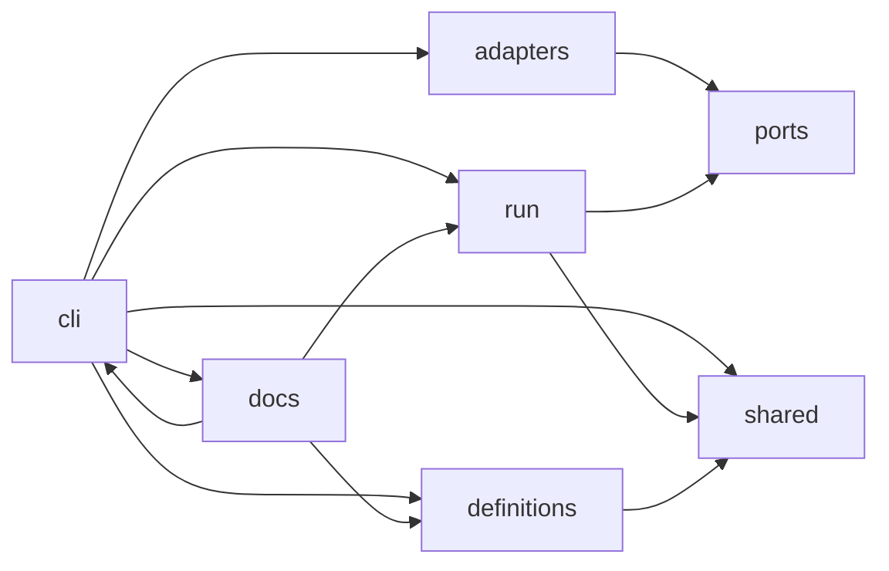

# Why the code has this shape

This page gives my reasons for the shape of the package in `src/delegate/`. I split it into two [**contexts**](../glossary.md#context), I put each outside system behind a [**port**](../glossary.md#port), and I wrote one rule for the direction of imports. [The layout of the repository](../reference/layout.md) holds the module table and the path of each file. This page does not repeat them.

## What I wanted from the layout

I wanted two things. The first was a rule that a test holds, so that a contributor learns the rule from a failing test and not from a review comment. The second was an [**engine**](../glossary.md#engine) that I can test end to end with no model, no network and no real agent. Both need the same thing: a place for each kind of code, and a fixed direction for the imports between the places.

## Two contexts

The kit does two jobs that share almost nothing.

The first job is the [**run**](../glossary.md#run) of a [**workflow**](../glossary.md#workflow). The engine builds each [**ticket**](../glossary.md#ticket) in its own [**worktree**](../glossary.md#worktree), and a [**verifier**](../glossary.md#verifier) checks the result. This code is in `run/`.

The second job is the work on agent files. One [**declaration**](../glossary.md#declaration) renders an [**agent pair**](../glossary.md#agent-pair) for each [**harness**](../glossary.md#harness), a [**validator**](../glossary.md#validator) checks the rendered files, and a [**bootstrap**](../glossary.md#bootstrap) sets up a repository. This code is in `definitions/`.

Each context has its own words. The run context speaks of tickets, worktrees and [**verdicts**](../glossary.md#verdict). The definitions context speaks of declarations, [**stacks**](../glossary.md#stack) and rendered files. The two contexts know nothing of each other: neither imports the other, in either direction. A change to the [**renderer**](../glossary.md#renderer) cannot break the engine through an import, and a change to the engine cannot break the renderer. I wanted that guarantee more than I wanted to share a helper.

## The shared tier

The two contexts need one thing in common: the [**tier table**](../glossary.md#tier-table), which names the model of each role in each harness. Neither context may import the other, so the table cannot live in either. It lives in `shared/`, below both.

The `shared` layer imports no other layer. That is the whole of its design. It holds one module today, `shared/tiers.py`, with its data file beside it. A layer that anything may import, and that imports nothing, cannot make a path from one context back to the other.

## The ports

A port is an interface that the run context drives. There are three, and each one is the name of a thing that the engine needs and does not own.

- The harness port runs one agent. It takes a request and gives a result, with an [**end state**](../glossary.md#end-state).
- The version-control port keeps the work of a run: the branches, the commits, the worktrees and the rebase.
- The [**gate**](../glossary.md#gate) port runs one gate command in a worktree, and it gives the exit status and the output.

A port speaks the language of the domain. The version-control port names no git command and no flag. The gate port names no shell.

I chose ports for two reasons. A harness process, git and a shell are outside systems, and I do not want the rules of a run to depend on how they work. And a port is the seam for a test: a test passes a scripted object through the same interface, so the engine runs end to end with no model. The run context also starts no process. All its process work goes through a port: the agent through the harness port, git through the version-control port, and a gate command through the gate port.

## The adapters

Code that implements a port is the only code that starts a process.

- The `claude-code` and `opencode` [**adapters**](../glossary.md#adapter) implement the harness port. Each one drives one harness through its [**headless**](../glossary.md#headless) command line.
- The [**git backend**](../glossary.md#git-backend) implements the version-control port.
- The shell gate runner implements the gate port. It runs the command with `bash -c`.

I keep the word "adapter" for the harness adapter that a user chooses in a workflow. The glossary does the same. The git backend and the shell gate runner are backends that the maintainer of the kit chooses, and no workflow names them.

The registry in `adapters/` holds the harness adapters by name. The workflow names one, and the command-line driver looks it up. The two backends are not in the registry. The driver makes them and gives them to the engine. A new harness needs one new module in `adapters/`, and it needs no change to the engine. See [how to add a harness adapter](../how-to/add-a-harness-adapter.md).

## The cli package and the docs tooling

The `cli/` package holds the command-line drivers. A driver is the composition point. It parses its arguments, makes the adapter and the backends, calls one use case in a context, and prints the result. The engine never chooses an adapter. Only `cli` parses command-line arguments, so the run context and the definitions context can run from a test with no argument parser.

The docs tooling is in `docs/`. It holds the generator that writes the reference sections, and the [**neutrality check**](../glossary.md#neutrality-check). It reads the code of the other layers, and the generator reads the argument parsers that `cli` builds. It parses nothing itself. Five layers never import it. Today only the `delegate docs` driver in `cli` does.

## The dependency rule

Dependencies point inward. The contexts and the ports are the inside. The adapters, the backends and the drivers are on the outside, and they depend on the inside, never the reverse.

An arrow is an import that the package has today. The test forbids some imports, and it does not require an arrow.

`tests/test_architecture.py` holds these rules, and nothing more:

- `run` never imports `adapters`, `cli`, `docs` or `definitions`.
- `definitions` never imports `adapters`, `cli`, `docs` or `run`.
- `ports` never imports `adapters`, `cli` or `docs`.
- `adapters` never imports `cli` or `docs`.
- `shared` imports no other layer of the package.
- No module outside `cli` parses command-line arguments.
- The files of `run/` start no process. They import no `subprocess`, and they use no `os` function that starts a process.
- `run/domain.py`, the rules of a run as functions of plain values, imports only `__future__`, `collections.abc` and `typing`.
- No file keeps an import for compatibility. A `noqa: F401` comment fails the test.
- The package top holds no module but `__init__.py`, and each directory with an `__init__.py` is in the `packages` list of `pyproject.toml`.

The test sets no limit on what `cli` and `docs` import. They are the outside, and they may import any layer.

I chose a test over a convention because a rule in a document drifts and a rule in the suite does not. The test reads the imports with the `ast` module, so it runs no code of the package. A second set of tests plants each violation in a [**temporary copy**](../glossary.md#temporary-copy) of the package and checks that the rule fails on it.

## What the rule does not give

The test reads import statements, so it sees a dependency that an import makes and no other. A module that is loaded by name with `importlib` is not an import statement, and the test does not see it. The rule also says nothing about the quality of a port. A port can be narrow or wide, and the test accepts both. The shape stops a wrong dependency. It does not make a good design, and I still read each change for that.

For the detail of the modules, the operations of each port and the places to change each thing, see [the layout of the repository](../reference/layout.md).
