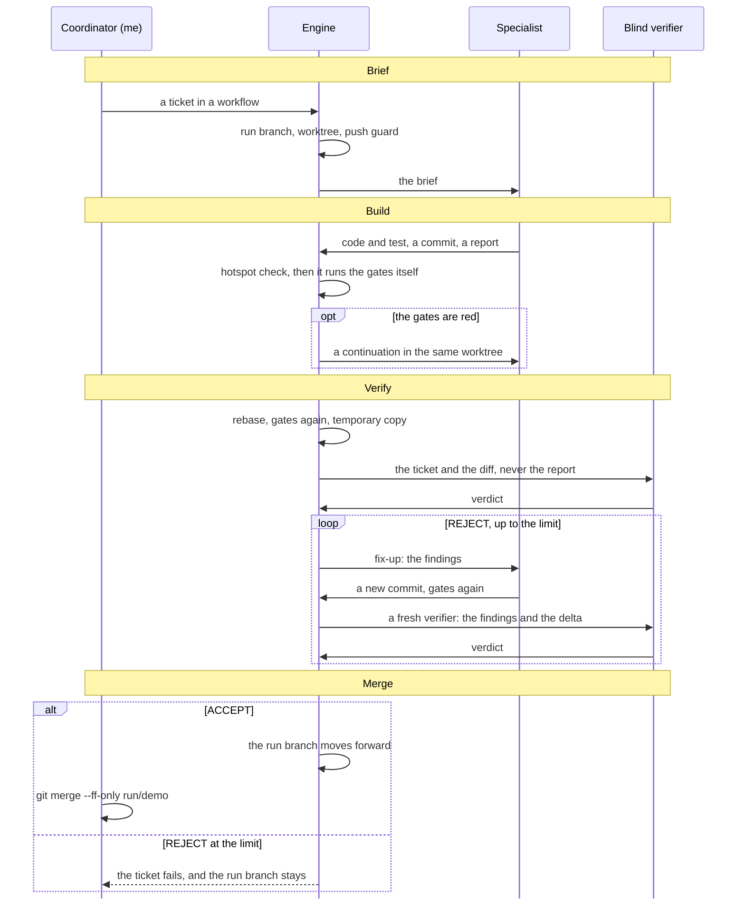

# Start here

Models are different. That sounds like a silly thing to say. It stops being silly when I notice that they differ the way people differ.

`delegate` is the machine I built so that the model I pick changes one thing only: how good the code is. This page is the kit at a glance: the problem, the idea, where the kit sits on the [**ladder**](glossary.md#ladder) that it climbs, the team, and how one [**ticket**](glossary.md#ticket) moves from the [**brief**](glossary.md#brief) to the merge. It is not a tutorial and it is not a reference. It links both at the end. Each term is in bold where it first appears, and it links its entry in the [glossary](glossary.md). After that, a dotted underline marks the term: hover for its definition, or follow it to its entry.

## The problem

I've worked with Haiku, Sonnet, Opus, Fable, Qwen and OpenAI's models, and each one frustrated me in its own way. I prefer Claude models, because they think and work most like I do. OpenAI's models approached problems differently from how I wanted them to, and they valued different things from what I value. So did the open-weight models.

Bassim Eledath names the cause in one sentence: "These models were post-trained differently and have meaningfully different dispositions." He puts those differences to work, and for exploration they help. For the build of one piece of work, a difference in disposition is noise.

So here's the question I started with. When I put a team of people on a customer problem, I want them to work as one team. How do I get a team of models to do the same? How do I get to the point where the model I pick doesn't matter?

Within the limits of what each model can do, of course. I want to wrap the right context, tools, process, constraints and support around a model, so that the only difference between running Qwen and running Opus is how good the code is. Not how well it reasoned about the task. Not how well it used the tools. Not how well it understood my context. Just the code.

### The same model, twice

It started with me in a terminal, driving one agent: write this function, build that feature. That works, but I was the process.

Then I delegated to subagents, and the inconsistency showed. I gave two Opus [**sessions**](glossary.md#session) two similar tickets, each a full vertical slice from the front end to the database. Same model, same kind of work. They planned in different ways, used the tools in different ways (sometimes more successfully, sometimes less), and wrote code that read differently. A short remark early in the conversation, about how I like to write Java or how I like to break down modules, changed the code that came back.

One model couldn't agree with itself. A team of different models had no chance, unless something other than the model held the way of working.

### Managing each model in prose

So I wrote the way of working down: a [**coordinator**](glossary.md#coordinator) session that I run, a [**specialist**](glossary.md#specialist) that builds, and a [**verifier**](glossary.md#verifier) that checks. Then came rules for each model: a section for one vendor's CLI, a [**headless**](glossary.md#headless) profile for another, and a checklist for models below a certain [**tier**](glossary.md#tier). Each section managed a model like a new colleague. It reminded the model of the habit I corrected yesterday and gave it a checklist for the one I expected tomorrow.

The prose helped, but it never held. A rule in prose binds one model and only advises the next one, and how seriously a model takes prose is one more way that models differ.

### Playing football

Then there was the review loop. The verifier rejects, and the specialist fixes. The verifier rejects again, and now it passes. Two rounds of [**fix-ups**](glossary.md#fix-up), a re-scope, and then a fresh verification of the whole change, even though two lines moved. Work got done very quickly. The quality was inconsistent, and the token bill was massive.

Add it up, and I was still the process. Every model needed managing, every review was a negotiation, and the cost grew with the back-and-forth, not with the work.

## The idea

Fix everything except the ability of the model.

When I put people on a team, I don't give each one a different process. They share one way of working, and they differ in skill. I want the same from models. So every agent gets the same [**team contract**](glossary.md#team-contract), whatever model runs it: a role, the context for that role, the tools that it may use, a definition of done, and an independent check of its work. The contract is the same in every [**harness**](glossary.md#harness) and at every price. When I change the model, the only thing left to change is the code. That's the thing I pick a model for.

The independent check is the core of the contract, and its rule is short: no claim that matters at a merge comes from the agent that wrote the code. Something other than that agent checks that the code builds and the tests pass. Something that never read the author's account checks that the change does what I asked for. And the merge stays mine.

None of this is mine alone. I wouldn't have met these problems, or solved them this way, without two pieces of work. The kit has three layers, and I credit each one where it belongs.

- *The map is Bassim Eledath's.* His [levels of agentic engineering](https://www.bassimeledath.com/blog/levels-of-agentic-engineering) are a ladder of eight levels, from tab completion to autonomous agent teams. It told me where I was, and what to build next. The rule of the ladder that matters most here is about order: "Levels 3 through 5 are the building blocks for everything that follows." He gives the reason too: "If your context is noisy, your prompts are under- or misspecified, or your tools are poorly described, levels 6 through 8 just amplify the mess." So the kit makes levels 3 to 5 explicit first, and it automates only on top of them.
- *The input is Matt Pocock's.* In [mattpocock/skills](https://github.com/mattpocock/skills), each planning [**skill**](glossary.md#skill) does one part of the thinking before an agent sees the work. [**`grilling`**](glossary.md#grilling) asks me questions, one round at a time, until each decision is made. [**`wayfinder`**](glossary.md#wayfinder) charts work that is too large for one session as a map of decisions. [**`to-spec`**](glossary.md#to-spec) writes the [**spec**](glossary.md#spec), and [**`to-tickets`**](glossary.md#to-tickets) cuts the spec into slices, each one a ticket that names the tickets that block it. The decisions are settled and the work is cut to size before an agent starts. Without that, no contract could fix the rest.
- *The execution is delegate.* It takes each ticket, hands it to an agent under the team contract, checks the result with evidence that the agent did not produce, and leaves it ready for me to merge.

## The ladder

Eledath describes the levels horizontally. A team climbs one level at a time, and each level is a set of practices that the team adopts across all of its work. I came at it the other way, the way `to-tickets` taught me to cut work. delegate is one vertical slice through levels 2 to 7: a [**tracer bullet**](glossary.md#tracer-bullet) in Pocock's sense, a narrow path through every layer, with a working tool at each level. The whole path works before any part of it gets wider.

The same picture as a table:

| Level | Eledath's name | What delegate puts there |
| --- | --- | --- |
| 1 | Tab Complete | Nothing. The slice starts at level 2. |
| 2 | Agent IDE | An existing harness, driven headless through an [**adapter**](glossary.md#adapter). |
| 3 | Context Engineering | A brief for each agent: the ticket, the [**file boundary**](glossary.md#file-boundary), and each [**gate**](glossary.md#gate) to run. Nothing else. |
| 4 | Compounding Engineering | The [**delegation document**](glossary.md#delegation-document), where each lesson becomes a rule, written down once. Each agent reads it live, through its [**context skill**](glossary.md#context-skill). |
| 5 | MCP and Skills | An [**agent pair**](glossary.md#agent-pair) for each [**stack**](glossary.md#stack), rendered from one [**declaration**](glossary.md#declaration) with every skill of the stack. |
| 6 | Harness Engineering & Automated Feedback Loops | The [**engine**](glossary.md#engine) runs the gates itself and stops a diff that touches a [**hotspot**](glossary.md#hotspot). A [**push guard**](glossary.md#push-guard) in git holds in every harness. |
| 7 | Background Agents | Headless agents in [**worktrees**](glossary.md#worktree), a [**blind**](glossary.md#blind) verifier, and a [**journal**](glossary.md#journal) that a stopped [**run**](glossary.md#run) resumes from. |
| 8 | Autonomous Agent Teams | Not attempted. The agents never talk to each other: the engine dispatches, and the merge stays yours. |

Read the rows from the top, and Eledath's rule shows. The engine at levels 6 and 7 automates only what levels 3 to 5 make explicit: the brief, the written rules, and the skills of each stack. Take those away and the engine just runs the mess faster.

## The mental model

### The team

Somewhere along the way this stopped being about delegation. It became about team members who all follow the same rules and work the same way, whatever model runs them. The team has four members, and each one has one job.

- The coordinator is me, a person. I direct the work from a terminal or from an interactive session of a harness. I settle the decisions, write the tickets, pick the tiers and own the merge.
- The specialist is an agent that builds one ticket.
- The verifier is a second agent that checks the work of the specialist. It holds every skill of the specialist, the instructions for that kind of code, so it judges the work by the same standard. But it can only read.
- The engine is `delegate run`: a program, not a model. It does the work that I don't trust a model to do: it writes the briefs, runs the gates, caps the fix-ups and keeps the record.

A specialist and its verifier are an agent pair, and a repository has one pair for each stack, each technology that it holds, such as a Python package or a web front end. One declaration writes both halves. It's the job description, and it's the same for every model that fills the seat.

### The loop: Brief, Build, Verify, Merge

Four verbs name the loop, and every ticket goes through all four.

- *Brief.* I write a ticket, and list it in a [**workflow**](glossary.md#workflow) file. The engine turns the ticket into a brief, the prompt for one agent.
- *Build.* The specialist builds the ticket in its own worktree and commits. The engine then runs the gates itself.
- *Verify.* A blind verifier checks the work. Blind means it gets the ticket and the diff, and never the specialist's own account of the work.
- *Merge.* Accepted work lands on the [**run branch**](glossary.md#run-branch), a branch that the engine owns. I merge the run branch.

### One ticket, from Brief to Merge

Here's one ticket through the loop: "The export command writes a header row."

1. *Brief.* I put the ticket in a workflow, with the stack `python`, the gate `python3 -m unittest`, and the hotspot `workflow.toml`, a path that only I change. I run `delegate run workflow.toml`, which starts a run. The engine creates the run branch `run/demo` from my [**base branch**](glossary.md#base-branch), `main`. It makes a worktree with its own branch for the ticket, and sets a push guard in it, so no push leaves that worktree. Then it writes the brief: the ticket, the file boundary (the worktree, and the hotspots that the specialist must not touch), the gate, and the path where the specialist writes its [**report**](glossary.md#report), its own account of the work.
2. *Build.* The specialist reads the brief, writes the header row and a test, commits, and writes its report: "committed, gates green". The engine does not take that word. It checks that the diff touches no hotspot, and then it runs `python3 -m unittest` itself. If the gate were red, or the agent ran out of turns, the engine would send the specialist back to the same worktree for a [**continuation**](glossary.md#continuation), and its commits would stay. Here the gate is green.
3. *Verify.* The engine rebases the branch onto the run branch and runs the gate again. It makes a [**temporary copy**](glossary.md#temporary-copy) of the branch, and gives the verifier a brief with two things in it: the ticket and the diff. Not the report. The verifier runs the gate in the copy. It breaks the code under the new test and watches the test go red, which is a [**red proof**](glossary.md#red-proof) that the test can fail. Then it writes its [**verdict**](glossary.md#verdict). This time the verdict is [**REJECT**](glossary.md#reject), with one [**finding**](glossary.md#finding): "The header row is missing when the data set is empty."
4. *Build again.* A REJECT starts a fix-up. The engine sends the finding, word for word, to the specialist in the same worktree. The specialist adds a new commit on top of the rejected one. It never amends. The engine runs the gate again.
5. *Verify again.* A fresh verifier gets the finding and the [**delta**](glossary.md#delta), the diff since the rejected commit, and checks only that. Its verdict is [**ACCEPT**](glossary.md#accept). Had it rejected again, a second round would follow, and at the limit the ticket fails and the run branch stays where it was.
6. *Merge.* On ACCEPT, the engine moves `run/demo` forward to the commit that the verifier saw. Then it stops. It never merges into `main`, never pushes, and never closes the ticket. I read the result with `delegate status`, and I merge with `git merge --ff-only run/demo`.

The same ticket, on one page:

Look at where the evidence comes from. The gate result comes from the engine, not from the agent that wrote the code. The verdict comes from an agent that never saw the report. The merge comes from me. No arrow that carries evidence starts at the specialist.

### Two dials: ability and assurance

I tune two things, and neither one touches the team contract.

The first dial is ability. A workflow names a tier, a strength, and never a model: `strong`, `standard`, `cheap` or `verifier`. The [**tier table**](glossary.md#tier-table) maps each tier to a model for each harness, and a [**tier file**](glossary.md#tier-file) can point the tiers at a [**gateway**](glossary.md#gateway). A new model, or a new vendor, changes one file and no workflow. Turn this dial, and the code gets better or worse. The brief, the gates and the check stay the same.

The second dial is assurance. The [**mode**](glossary.md#mode) trades cost against how soon I learn that something is wrong. [**`assure`**](glossary.md#assure) is the mode of the example: it verifies each ticket at once, before the next ticket builds on it. [**`economy`**](glossary.md#economy) builds a [**chain**](glossary.md#chain), where each ticket starts from the one before, and verifies once for each stack at the end. It costs the fewest tokens, and a defect shows late.

One dial sets how good the code is. The other sets how soon I find out that it is not.

Neither dial changes an [**invariant**](glossary.md#invariant), one of the seven rules that hold in every mode. The verifier is blind. The engine runs the gates. Nothing reaches the run branch without an ACCEPT. And a cheaper mode never means a weaker verifier, because a cheap check is a false saving.

### What the engine keeps

The engine records the run in the journal: one line for each event, appended and never rewritten. Gate results, verdicts, fix-ups and each move of the run branch are all in it.

I made it this way for three reasons. A run that stops, after Ctrl-C, a kill or a pause overnight, can [**resume**](glossary.md#resume) from the journal at the first ticket that is not complete, and it never builds a finished ticket again. `delegate status` and `delegate watch` read the journal, so I can see where a run is, and `watch` exits when the run needs me. And the journal is the record of the evidence: what ran, in which order, with which result. It's also the first place to look when a model falls short, because every REJECT and every fix-up round is in it.

## What delegate is not

- *Not a model router.* It does not read a ticket and choose a model for it. A workflow names tiers, and the tier table maps each tier to a model. The choice stays with me, in one file.
- *Not an agent swarm.* The agents never talk to each other, and they never claim work from each other. That is level 8 of the ladder, and the kit does not attempt it. The engine dispatches, and I coordinate.
- *Not a way to make a weak model strong.* The contract and the checks are the same for every model, so a weak model fails where I can see it: red gates, REJECT verdicts, and fix-up rounds in the journal. The kit makes a weak model visibly weak. That tells me which tier to change.
- *Not a coding agent, and not a harness.* It writes no code. It drives an existing harness through its command line, and the agents in that harness write the code.
- *Not an issue tracker.* It reads each ticket, one unit of work written as behaviour, from a local file or from inline text. It never contacts a tracker and never closes a ticket. The tickets go to disk first.
- *Not a CI system.* It runs each gate of the repository (a command that proves a change is good, such as the test suite) on the local machine, to decide whether the work of one ticket can land. It never pushes, and it does not replace the checks that run after a push.
- *Not a sandbox.* An agent runs as the person who started it, with their permissions, in a worktree. If a policy needs a container, this kit is not enough by itself.

## The parts of the kit

- The `agent-delegation` skill holds the [**protocol**](glossary.md#protocol): the roles, the brief template, blind verification, fix-ups and hotspots, in words that an agent reads. A person can follow it by hand for a single ticket.
- The `agent-definitions` skill holds the rules of the [**renderer**](glossary.md#renderer) and the [**validator**](glossary.md#validator). One declaration renders an agent pair for each harness, and the validator checks the files against the schema of each harness.
- The command [**bootstrap**](glossary.md#bootstrap) writes the declaration, the agent pair, and a context skill that reads the delegation document of the repository, the file with its gates, its hotspots and its rules.
- The [**brief generator**](glossary.md#brief-generator) builds every verifier brief from the ticket, the diff and the gates, and never from the report.
- The engine drives each harness through an adapter. Claude Code and OpenCode have one today.
- The tier table maps each tier to a model for each harness, so a workflow never names a model.

The two skills are in `skills/`, and the package that holds every command is in `src/delegate/`. [The layout of the repository](reference/layout.md) gives the place of each part and the direction of imports in the package.

## Where to go next

- [The tutorial](tutorial.md) runs the loop once, from install to one verified ticket. Start there.
- The how-to pages each solve one job: [bootstrap a single-stack repository](how-to/bootstrap-a-single-stack-repository.md), [bootstrap a monorepo](how-to/bootstrap-a-monorepo.md), [run an economy chain](how-to/run-an-economy-chain.md), [watch and resume a run](how-to/watch-and-resume-a-run.md), [point the tiers at a gateway](how-to/point-the-tiers-at-a-gateway.md), [add a harness adapter](how-to/add-a-harness-adapter.md), and [use the kit after `to-spec` and `to-tickets`](how-to/use-the-kit-after-to-spec-and-to-tickets.md).
- The reference gives every field and every flag: [the workflow file](reference/workflow.md), [`delegate run`](reference/run.md), [`delegate status` and `delegate watch`](reference/status-and-watch.md), and [`render`, `validate`, `bootstrap` and `brief`](reference/commands.md).
- The explanation pages give the reasons: [why the model should not matter](explanation/why-the-model-should-not-matter.md), [why the verifier is blind](explanation/why-the-verifier-is-blind.md), [why each specialist has its own verifier](explanation/why-each-specialist-has-its-own-verifier.md), [the mode trade-off](explanation/the-mode-trade-off.md), [the enforcement model and its limits](explanation/the-enforcement-model-and-its-limits.md), [prior art](explanation/prior-art.md), and [the decision records](explanation/decision-records.md).
- The [glossary](glossary.md) holds every term, with the page that explains it in full.
