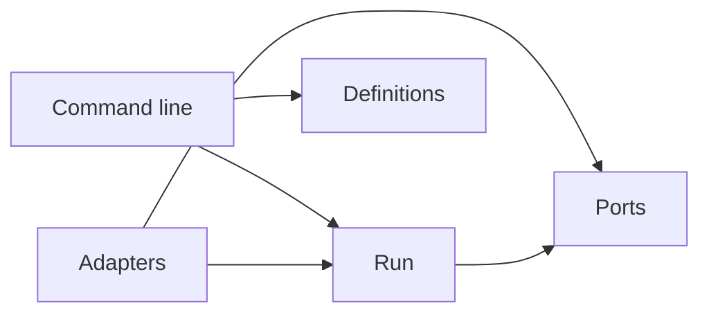

# The layout of the repository

The repository holds three things: two skills that an agent reads, one Python package that holds every command, and the docs. This page gives the place of each part at a high level, and the rule for the direction of imports in the package. It describes the repository as it is today.

## The top level

| Path | What it holds |
| --- | --- |
| `skills/agent-delegation/` | The [**protocol**](../glossary.md#protocol) skill: the roles, the [**brief**](../glossary.md#brief) template, blind verification, [**fix-ups**](../glossary.md#fix-up) and [**hotspots**](../glossary.md#hotspot), in words that an agent reads. |
| `skills/agent-definitions/` | The definitions skill: the rules of the [**renderer**](../glossary.md#renderer) and the [**validator**](../glossary.md#validator), and the neutrality [**allowlist**](../glossary.md#allowlist). |
| `src/delegate/` | The Python package. It holds the commands `delegate`, `agent-definitions` and `verifier-brief`. |
| `tests/` | The pytest suite of the package and of the docs, with the recorded [**harness**](../glossary.md#harness) streams in `tests/fixtures/`. |
| `docs/` | The source of the docs site. `docs/adr/` holds the decision records, and `docs/agents/` holds the agent rules of this repository. The site excludes both. |
| `examples/` | A sample [**declaration**](../glossary.md#declaration), and the sample repository of the tutorial. |
| `scripts/` | The release script. |
| `pyproject.toml`, `package.nix`, `flake.nix` | The package build for `pip` and for Nix. Nix is optional. |
| `zensical.toml`, `overrides/`, `includes/` | The configuration, the theme and the generated abbreviations of the docs site. |
| `design/` | A snapshot of the design of the docs theme. |

## The package

The modules of `src/delegate/` fall into five groups. Each group does one job.

| Group | Modules | Job |
| --- | --- | --- |
| Definitions | `declaration.py`, `render.py`, `validate.py`, `bootstrap.py`, `templates/` | Load a declaration, render an [**agent pair**](../glossary.md#agent-pair) for each harness, validate the rendered files, and [**bootstrap**](../glossary.md#bootstrap) a repository. |
| Run | `run/workflow.py`, `run/engine.py`, `run/guards.py`, `run/journal.py`, `run/lock.py`, `run/reports.py`, `run/runs.py`, `run/brief.py`, `run/status.py`, `run/watch.py` | Check a [**workflow**](../glossary.md#workflow), build its [**tickets**](../glossary.md#ticket), hold the guards, write the [**journal**](../glossary.md#journal), build the [**verifier**](../glossary.md#verifier) [**brief**](../glossary.md#brief) from the ticket, the diff and the [**gates**](../glossary.md#gate) and never from the [**report**](../glossary.md#report), and report the state of a [**run**](../glossary.md#run). |
| [**Adapters**](../glossary.md#adapter) | `adapters/__init__.py`, `adapters/streams.py`, `adapters/claude_code.py`, `adapters/opencode.py`, `adapters/git.py` | Implement the ports. Each harness adapter drives one harness through its [**headless**](../glossary.md#headless) command line. The git backend implements the version-control port. The package also holds the registry of harness adapters by name. |
| Ports | `ports/harness.py`, `ports/vcs.py` | The interfaces that the [**engine**](../glossary.md#engine) drives. The harness port runs one agent: the request, the result, the [**end states**](../glossary.md#end-state), and the error. The version-control port keeps the work of a run: the branches, the commits, the [**worktrees**](../glossary.md#worktree), the rebase, and the [**verifier copy**](../glossary.md#verifier-copy). |
| Commands and checks | `delegate.py`, `cli.py`, `run_command.py`, `brief.py`, `status.py`, `watch.py`, `reference.py`, `neutrality.py`, `tiers.py`, `tiers.toml` | The command-line entry points, the generator of the reference sections, the [**neutrality check**](../glossary.md#neutrality-check), and the [**tier table**](../glossary.md#tier-table). `brief.py`, `status.py` and `watch.py` are thin: each one makes the git backend and calls the module of the same name in `run/`. `run_command.py` is the driver of `delegate run`. |

## The dependency rule

Dependencies point inward. Run and Definitions are the two bounded contexts, and they hold the domain. The ports are the interfaces that the domain drives. The adapters implement the ports, and the command line drives the domain.

Five rules follow, and `tests/test_architecture.py` holds them:

- `run` never imports `adapters` or `cli`.
- `definitions` never imports `adapters` or `cli`.
- `ports` never imports `adapters` or `cli`.
- `adapters` never imports `cli`.
- The files of `run/` run no git command. The guards and the [**brief generator**](../glossary.md#brief-generator) read the repository through the version-control port, as the engine does. The test reads the calls to `subprocess` in these files and fails on a call that names git. A gate command that the engine runs through `subprocess` is not git, so it passes.

A layer is a subpackage of `src/delegate/`. Today `run/`, `definitions/`, `ports/` and `adapters/` exist, and `definitions/` is empty. The other modules are flat. A flat module joins its layer when it moves into the subpackage, and from then on the test checks it. The test reads the imports with the `ast` module of the standard library, so it runs no code of the package.

The composition point is the command-line driver. `delegate run` reads the name of the adapter from the workflow, looks it up in `adapters`, and passes the adapter to the engine. The engine never chooses an adapter. The commands `verifier-brief`, `delegate status` and `delegate watch` make the git backend in the same way, and pass it to the module of the same name in `run/`.

## The version-control port

Git is an outside system, so it belongs behind a driven port, an interface that the engine drives and an adapter implements. The port is `ports/vcs.py`, and the git backend is `adapters/git.py`. The command-line driver makes the backend and gives it to the engine, as it gives the harness adapter. The run context keeps the work of a run through the port. The engine makes the [**run branch**](../glossary.md#run-branch) and the [**worktrees**](../glossary.md#worktree), keeps the file watcher off in them, rebases a ticket branch onto the run branch, reads the commit ranges, makes the [**verifier copy**](../glossary.md#verifier-copy), and moves the run branch. The run context runs no git command itself, and a test checks that.

The port speaks the language of the domain. It names no git command and no flag, and a test checks that. Each operation has a test in `tests/test_vcs_git.py`, which runs the git backend on a real temporary repository and calls the port only.

| Operation | What it does |
| --- | --- |
| `repository_root`, `shared_data_directory` | Find the top of the checkout, and the directory that the checkout and all its worktrees share, where the engine keeps its state. |
| `branch_exists`, `create_branch`, `branch_tip` | Look for a branch, make the [**run branch**](../glossary.md#run-branch) or a ticket branch, and read its newest commit. |
| `commit_of`, `head_commit`, `commits_since` | Name a commit, and list the commits that a branch holds beyond another. |
| `ensure_worktree`, `remove_worktree` | Make the [**worktree**](../glossary.md#worktree) of a ticket, or reuse one that a killed run left, and remove it. |
| `rebase_onto` | Put the commits of a ticket branch on top of the run branch. A conflict or a refusal gives a result, and the worktree keeps the state from before. |
| `changed_paths`, `diff_text`, `uncommitted_changes` | List the paths that differ between two commits, read the text of those changes for the [**brief**](../glossary.md#brief), and list the paths that a worktree changed and did not commit. The [**hotspot**](../glossary.md#hotspot) guard and the worktree check of a verifier use them. |
| `hooks_directory`, `use_hooks_directory` | Find the hooks that run for a worktree, and set a hooks directory for that worktree alone. The [**push guard**](../glossary.md#push-guard) uses them. |
| `is_ancestor`, `fast_forward_branch` | Ask whether a commit holds another, and move the run branch to a verified commit by fast-forward only. |
| `make_verifier_copy`, `stop_file_watcher` | Make the [**verifier copy**](../glossary.md#verifier-copy), and stop the background watcher of the file system before a directory goes. |

The git backend keeps one rule for every worktree and every copy that it makes: `core.fsmonitor` is off. With the setting on, git starts a daemon for each repository it touches, and the daemon outlives its directory. A worktree gets the setting in its own configuration, and a copy gets it in its own repository, so the configuration of the user and of the main checkout stays as it was.

## Where to change what

- A new harness: an adapter module in `adapters/`, beside `claude_code.py`, a [**contract test**](../glossary.md#contract-test) in `tests/`, and recorded streams in `tests/fixtures/`. See [how to add a harness adapter](../how-to/add-a-harness-adapter.md).
- A new flag, exit code, guard command or [**finding code**](../glossary.md#finding-code): change the code, then run `delegate docs`. See [`delegate docs`](docs.md).
- A new decision: an [**ADR**](../glossary.md#adr) in `docs/adr/`, and a line in [the decision records](../explanation/decision-records.md).
- The gates and the hotspots of this repository: `docs/agents/delegation.md`.
