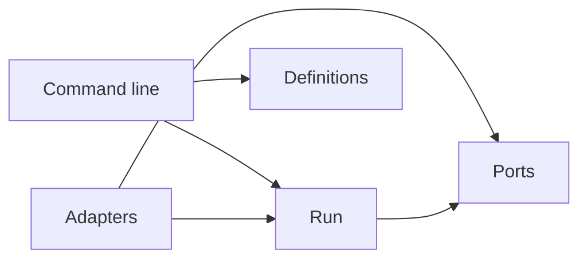

# The layout of the repository

The repository holds three things: two skills that an agent reads, one Python package that holds every command, and the docs. This page gives the place of each part at a high level, and the rule for the direction of imports in the package. It describes the repository as it is today.

## The top level

| Path | What it holds |
| --- | --- |
| `skills/agent-delegation/` | The [**protocol**](../glossary.md#protocol) skill: the roles, the [**brief**](../glossary.md#brief) template, blind verification, [**fix-ups**](../glossary.md#fix-up) and [**hotspots**](../glossary.md#hotspot), in words that an agent reads. |
| `skills/agent-definitions/` | The definitions skill: the rules of the [**renderer**](../glossary.md#renderer) and the [**validator**](../glossary.md#validator), and the neutrality [**allowlist**](../glossary.md#allowlist). |
| `src/delegate/` | The Python package. It holds the commands `delegate`, `agent-definitions` and `verifier-brief`. |
| `tests/` | The pytest suite of the package and of the docs, with the recorded [**harness**](../glossary.md#harness) streams in `tests/fixtures/`. |
| `docs/` | The source of the docs site. `docs/adr/` holds the decision records, and `docs/agents/` holds the agent rules of this repository. The site excludes both. |
| `examples/` | A sample [**declaration**](../glossary.md#declaration), and the sample repository of the tutorial. |
| `scripts/` | The release script. |
| `pyproject.toml`, `package.nix`, `flake.nix` | The package build for `pip` and for Nix. Nix is optional. |
| `zensical.toml`, `overrides/`, `includes/` | The configuration, the theme and the generated abbreviations of the docs site. |
| `design/` | A snapshot of the design of the docs theme. |

## The package

The modules of `src/delegate/` fall into five groups. Each group does one job.

| Group | Modules | Job |
| --- | --- | --- |
| Definitions | `declaration.py`, `render.py`, `validate.py`, `bootstrap.py`, `templates/` | Load a declaration, render an [**agent pair**](../glossary.md#agent-pair) for each harness, validate the rendered files, and [**bootstrap**](../glossary.md#bootstrap) a repository. |
| Briefs | `brief.py` | Build a [**verifier**](../glossary.md#verifier) brief from the [**ticket**](../glossary.md#ticket), the diff and the [**gates**](../glossary.md#gate), and never from the [**report**](../glossary.md#report). |
| Run | `run.py`, `workflow.py`, `engine.py`, `guards.py`, `journal.py`, `lock.py`, `reports.py`, `runs.py`, `tiers.py`, `tiers.toml`, `status.py`, `watch.py` | Check a [**workflow**](../glossary.md#workflow), build its tickets, hold the guards, write the [**journal**](../glossary.md#journal), and report the state of a [**run**](../glossary.md#run). |
| [**Adapters**](../glossary.md#adapter) | `adapters.py`, `claude_code.py`, `opencode.py` | Drive one harness through its [**headless**](../glossary.md#headless) command line. |
| Commands and checks | `delegate.py`, `cli.py`, `reference.py`, `neutrality.py` | The command-line entry points, the generator of the reference sections, and the [**neutrality check**](../glossary.md#neutrality-check). |

## The dependency rule

Dependencies point inward. Run and Definitions are the two bounded contexts, and they hold the domain. The ports are the interfaces that the domain drives. The adapters implement the ports, and the command line drives the domain.

Three rules follow, and `tests/test_architecture.py` holds them:

- `run` never imports `adapters` or `cli`.
- `definitions` never imports `adapters` or `cli`.
- `ports` never imports `adapters` or `cli`.

A layer is a subpackage of `src/delegate/`. Today `definitions/` and `ports/` exist and are empty, and the other modules are flat. A flat module joins its layer when it moves into the subpackage, and from then on the test checks it. The test reads the imports with the `ast` module of the standard library, so it runs no code of the package.

## Where to change what

- A new harness: an adapter module beside `claude_code.py`, a [**contract test**](../glossary.md#contract-test) in `tests/`, and recorded streams in `tests/fixtures/`. See [how to add a harness adapter](../how-to/add-a-harness-adapter.md).
- A new flag, exit code, guard command or [**finding code**](../glossary.md#finding-code): change the code, then run `delegate docs`. See [`delegate docs`](docs.md).
- A new decision: an [**ADR**](../glossary.md#adr) in `docs/adr/`, and a line in [the decision records](../explanation/decision-records.md).
- The gates and the hotspots of this repository: `docs/agents/delegation.md`.
